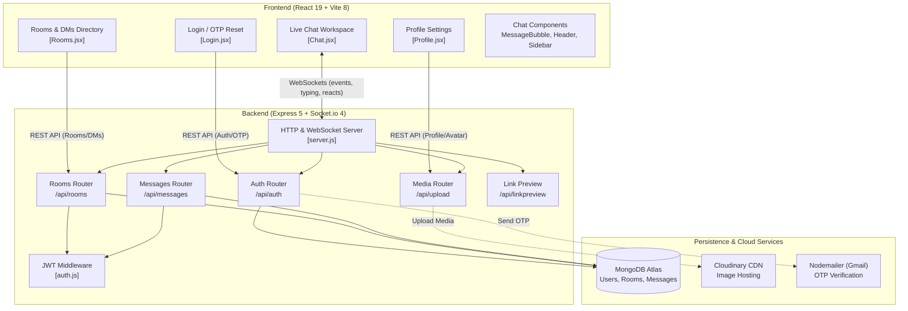

# 💬 Aura — Real-Time MERN Chat Platform

<div align="center">


[](https://aura-app-in-chat.vercel.app/)
[](https://aura-app-keg8.onrender.com)
[](https://github.com/Ritik639471/Aura-app)

<br/>

[](https://react.dev/)
[](https://vitejs.dev/)
[](https://tailwindcss.com/)
[](https://www.framer.com/motion/)
[](https://nodejs.org/)
[](https://expressjs.com/)
[](https://www.mongodb.com/)
[](https://socket.io/)
[](https://cloudinary.com/)

**A modern, production-grade real-time chat platform engineered with React 19, Express 5, MongoDB, and bi-directional WebSocket communication via Socket.io.**

[Explore Live Demo](https://aura-app-in-chat.vercel.app/) · [Report Bug](https://github.com/Ritik639471/Aura-app/issues) · [Request Feature](https://github.com/Ritik639471/Aura-app/issues)

</div>

---

## 📖 Table of Contents
- [Overview](#-overview)
- [Key Features](#-key-features)
- [Architecture & Data Flow](#-architecture--data-flow)
- [Tech Stack](#-tech-stack)
- [Project Directory Structure](#-project-directory-structure)
- [API Reference](#-api-reference)
- [Socket.io Events](#-socketio-events)
- [Getting Started Locally](#-getting-started-locally)
- [Environment Configuration](#-environment-configuration)
- [Deployment Guide](#-deployment-guide)
- [Author & Acknowledgments](#-author--acknowledgments)

---

## 🌟 Overview

**Aura** delivers a seamless, Discord/Slack-inspired communication experience. Built on a resilient MERN architecture with bi-directional Socket.io synchronizations, it provides instantaneous messaging, channel-based collaboration, direct conversations, live presence tracking, rich media sharing via Cloudinary, and granular role-based room administration.

---

## ✨ Key Features

### 💬 Real-Time Messaging & Interactions
- **Bi-Directional WebSockets:** Powered by Socket.io for instantaneous message delivery with sub-second latency.
- **Direct Messages & Public Channels:** Create community channels or initiate private 1-on-1 conversations with online/offline indicators.
- **Message Reactions:** Real-time multi-emoji reactions (`👍`, `❤️`, `😂`, `😮`, `😢`, `🔥`) with toggle state persistence.
- **Message Editing & Soft Deletion:** Edit your own sent messages with an `(edited)` tag; soft-delete messages seamlessly.
- **Read Receipts & Delivery Status:** Visual indicators (`✓` sent, `✓✓` read in blue) synced across participants.
- **Typing Indicators:** Real-time broadcast when conversation partners are typing.
- **Reply & Threading Context:** Reference earlier messages with quote replies.

### 📎 Media & Rich Content
- **Cloudinary Image Uploads:** Direct multi-part image uploads through Multer with Cloudinary CDN storage and caching.
- **Automated OpenGraph Link Previews:** Pasted URLs trigger automated server-side metadata scrapers to render rich preview cards (title, description, thumbnail).
- **Custom Emoji Picker:** 30+ curated emojis with an intuitive popover trigger.

### 🛡️ Moderation & Room Control
- **Role Hierarchy (Creator vs. Admin vs. Member):** Room owners can promote trusted members to admin or demote them.
- **Pinned Announcements:** Admins can pin important messages, spotlighted in an amber header bar.
- **Room Clearing:** Creator and Admins can purge chat history for fresh sessions.
- **Membership Gatekeeping:** Protected room access where users explicitly join before reading or emitting messages.

### 🔐 Authentication & User Profiles
- **JWT Authentication:** Stateless, signed JSON Web Tokens stored securely in the browser.
- **Bcrypt Password Security:** 10-round salted hash generation for credential security.
- **OTP Password Recovery:** Secure email verification flow using Nodemailer to send time-limited one-time passwords.
- **Custom Profiles:** Cloudinary-backed avatar uploads, 160-character bio, and custom status emoji.

---

## 📐 Architecture & Data Flow



---

## 🛠️ Tech Stack

### Frontend
- **Framework:** React 19 (`19.2.4`) + Vite 8
- **Styling:** Tailwind CSS v4 (`4.2.2`) + Vanilla CSS glassmorphism
- **Animations:** Framer Motion (`12.38.0`) + `@react-spring/web`
- **Routing:** React Router DOM v7 (`7.13.2`)
- **Icons:** Lucide React (`lucide-react`)
- **Real-Time Client:** Socket.io Client (`4.8.3`)
- **HTTP Client:** Axios (`1.13.6`)

### Backend
- **Runtime:** Node.js (ES Modules)
- **Framework:** Express 5 (`5.2.1`)
- **Real-Time Engine:** Socket.io (`4.8.3`)
- **Database & ODM:** MongoDB Atlas + Mongoose (`9.3.1`)
- **Authentication:** JSON Web Tokens (`jsonwebtoken` 9.0.3) + `bcrypt` (6.0.0)
- **File Uploads:** Multer (`2.1.1`) + `multer-storage-cloudinary`
- **Cloud Media:** Cloudinary Node SDK (`1.41.3`)
- **Mailing:** Nodemailer (`8.0.3`)

---

## 📁 Project Directory Structure

```text
Aura-app/
├── backend/
│   ├── middleware/
│   │   └── auth.js             # JWT verification & payload extraction
│   ├── models/
│   │   ├── Message.js          # Chat message schema (reactions, readBy, pinned, edit flags)
│   │   ├── Room.js             # Channel & DM schema (members, admins, isDirectMessage)
│   │   └── User.js             # User account schema (credentials, avatar, bio, status, OTP)
│   ├── routes/
│   │   ├── auth.js             # Signup, login, forgot password, reset password
│   │   ├── linkpreview.js      # URL metadata scraper for OpenGraph tags
│   │   ├── message.js          # Message fetch, update, delete, pin, clear
│   │   ├── profile.js          # User profile retrieval and bio/avatar updates
│   │   ├── room.js             # Room discovery, creation, DM initiation, admin roles
│   │   └── upload.js           # Cloudinary image upload handlers
│   ├── server.js               # Express app initialization & Socket.io event loop
│   └── package.json
│
└── frontend/
    ├── src/
    │   ├── components/
    │   │   ├── ChatSidebar.jsx     # Active room members & online user list
    │   │   ├── EmojiPicker.jsx     # Quick emoji reaction & insert popup
    │   │   ├── GroupInfoModal.jsx  # Member management, admin delegation dialog
    │   │   ├── Header.jsx          # Top navigation, active room info, theme styling
    │   │   ├── Layout.jsx          # Shell layout wrapper
    │   │   ├── MemberPanel.jsx     # Room member info panel
    │   │   ├── MessageBubble.jsx   # Message rendering with reactions, edit, pin, previews
    │   │   ├── SidebarPrimary.jsx  # Navigation icons & quick switchers
    │   │   └── SidebarSecondary.jsx# Channels and DMs list with unread counters
    │   ├── pages/
    │   │   ├── Chat.jsx            # Core chat controller & socket coordinator
    │   │   ├── Login.jsx           # Unified auth portal (Login, Signup, OTP Reset)
    │   │   ├── Profile.jsx         # Profile customization view
    │   │   └── Rooms.jsx           # Public channels & direct message launcher
    │   ├── config.js               # Environment API & Socket URLs
    │   ├── App.jsx                 # App routes and session guard
    │   ├── index.css               # Design tokens & glassmorphic utility styles
    │   └── main.jsx                # React DOM root entry
    ├── vite.config.js
    └── package.json
```

---

## 🔌 API Reference

### Authentication (`/api/auth`)
| Method | Endpoint | Description | Auth Required |
|:---|:---|:---|:---:|
| `POST` | `/api/auth/signup` | Register a new user account | No |
| `POST` | `/api/auth/login` | Authenticate with email/username & receive JWT | No |
| `POST` | `/api/auth/forgot-password` | Request email OTP for password recovery | No |
| `POST` | `/api/auth/reset-password` | Validate OTP and set a new password | No |

### Rooms & Channels (`/api/rooms`)
| Method | Endpoint | Description | Auth Required |
|:---|:---|:---|:---:|
| `GET` | `/api/rooms` | Fetch all public channels + current user's DMs | Yes |
| `POST` | `/api/rooms` | Create a new channel | Yes |
| `DELETE`| `/api/rooms/:id` | Delete an entire room (creator only) | Yes |
| `POST` | `/api/rooms/:id/join` | Join an existing room | Yes |
| `POST` | `/api/rooms/dm/:username` | Open or retrieve a direct message conversation | Yes |
| `POST` | `/api/rooms/:id/make-admin` | Elevate a member to room admin | Yes |
| `DELETE`| `/api/rooms/:id/remove-admin` | Revoke admin privileges | Yes |

### Messages (`/api/messages`)
| Method | Endpoint | Description | Auth Required |
|:---|:---|:---|:---:|
| `GET` | `/api/messages/:roomName` | Retrieve message history for a room | Yes |
| `GET` | `/api/messages/:roomName/pinned` | Fetch pinned messages in a room | Yes |
| `PUT` | `/api/messages/:id` | Edit message text (author only) | Yes |
| `DELETE`| `/api/messages/:id` | Soft-delete a message (author or admin) | Yes |
| `POST` | `/api/messages/:id/pin` | Pin or unpin a message (admin only) | Yes |
| `DELETE`| `/api/messages/room/:roomName/clear` | Clear all messages from a room (admin only) | Yes |

### Profile & Media (`/api/profile`, `/api/upload`, `/api/linkpreview`)
| Method | Endpoint | Description | Auth Required |
|:---|:---|:---|:---:|
| `GET` | `/api/profile/:username` | Retrieve public profile of a user | No |
| `PUT` | `/api/profile` | Update own bio, avatar URL, and status | Yes |
| `POST` | `/api/upload` | Upload image file to Cloudinary | Yes |
| `GET` | `/api/linkpreview?url=<target>` | Fetch OpenGraph tags for URL preview card | No |

---

## ⚡ Socket.io Events

| Event Name | Direction | Payload | Description |
|:---|:---:|:---|:---|
| `join_room` | Emit | `{ room, username }` | Join room and subscribe to updates |
| `leave_room` | Emit | `{ room, username }` | Leave active room room |
| `send_message` | Emit | `{ room, author, message, time, replyTo }` | Send a new chat message |
| `receive_message` | Listen | Full message object | Broadcast received message to room |
| `typing` | Emit | `{ room, username }` | Announce user typing status |
| `stop_typing` | Emit | `{ room, username }` | Clear typing indicator |
| `toggle_reaction`| Emit | `{ messageId, emoji, username }` | Add or remove emoji reaction |
| `reaction_updated` | Listen | `{ messageId, reactions }` | Broadcast updated reaction list |
| `mark_read` | Emit | `{ room, username }` | Mark all unread messages as viewed |
| `message_edited` | Emit/Listen | `{ messageId, message, room }` | Broadcast updated message text |
| `message_deleted` | Emit/Listen | `{ messageId }` | Broadcast soft-deleted message ID |
| `message_pinned` | Emit/Listen | `{ messageId, pinned, room }` | Broadcast pin state change |
| `room_cleared` | Emit/Listen | `{ room }` | Notify participants that chat was wiped |

---

## 🚀 Getting Started Locally

### Prerequisites
- [Node.js](https://nodejs.org/) (v18 or higher recommended)
- [MongoDB Atlas](https://www.mongodb.com/) cluster URI or local MongoDB daemon
- [Cloudinary](https://cloudinary.com/) account credentials
- Gmail account with an App Password generated for OTP delivery

### 1. Clone the Repository
```bash
git clone https://github.com/Ritik639471/Aura-app.git
cd Aura-app
```

### 2. Backend Setup
```bash
cd backend
npm install
```

Create a `.env` file in the `backend/` directory:
```env
PORT=5000
MONGO_URI=mongodb+srv://<username>:<password>@cluster.mongodb.net/aura-chat
JWT_SECRET=your_jwt_secret_key_here
EMAIL_USER=your_email@gmail.com
EMAIL_PASS=your_gmail_app_password
CLIENT_URL=http://localhost:5173
CLOUDINARY_CLOUD_NAME=your_cloudinary_cloud_name
CLOUDINARY_API_KEY=your_cloudinary_api_key
CLOUDINARY_API_SECRET=your_cloudinary_api_secret
```

Start the backend server:
```bash
npm run dev
```

### 3. Frontend Setup
Open a new terminal window:
```bash
cd frontend
npm install
```

Create a `.env` file in `frontend/` (optional for local testing):
```env
VITE_API_URL=http://localhost:5000/api
VITE_SOCKET_URL=http://localhost:5000
```

Start the Vite development server:
```bash
npm run dev
```

Navigate to `http://localhost:5173` in your browser.

---

## ⚙️ Environment Configuration

| Variable | Scope | Description |
|:---|:---|:---|
| `PORT` | Backend | Port number for Express/Socket.io (default: 5000) |
| `MONGO_URI` | Backend | MongoDB connection string (Atlas or local) |
| `JWT_SECRET` | Backend | Secret key used to sign and verify JWT authentication tokens |
| `EMAIL_USER` | Backend | Gmail account used by Nodemailer to transmit OTPs |
| `EMAIL_PASS` | Backend | Gmail App-specific password |
| `CLIENT_URL` | Backend | Frontend URL allowed by CORS |
| `CLOUDINARY_CLOUD_NAME` | Backend | Cloudinary cloud name for media asset storage |
| `CLOUDINARY_API_KEY` | Backend | Cloudinary API Key |
| `CLOUDINARY_API_SECRET` | Backend | Cloudinary API Secret |
| `VITE_API_URL` | Frontend | REST API base endpoint |
| `VITE_SOCKET_URL` | Frontend | WebSocket endpoint for Socket.io connection |

---

## 🌐 Deployment Guide

### Backend on Render
1. Create a **New Web Service** on [Render](https://render.com).
2. Connect your GitHub repository (`Ritik639471/Aura-app`).
3. Set **Root Directory** to `backend`.
4. Build Command: `npm install`
5. Start Command: `node server.js`
6. Supply all backend environment variables from the table above.

### Frontend on Vercel
1. Import your GitHub repository on [Vercel](https://vercel.com).
2. Set **Root Directory** to `frontend`.
3. Framework Preset: `Vite`.
4. Add environment variables:
   - `VITE_API_URL=https://aura-app-keg8.onrender.com/api`
   - `VITE_SOCKET_URL=https://aura-app-keg8.onrender.com`
5. Deploy!

---

## 👤 Author & Acknowledgments

Developed with ❤️ by **[Ritik Maurya](https://github.com/Ritik639471)**

- 🎓 B.Tech in Electrical Engineering, **NIT Durgapur**
- 🏆 ICPC '25 Regionalist (Amritapuri & Kanpur, Rank 80)
- ⚔️ Codeforces Specialist (1417) · CodeChef 3-Star (1696) · LeetCode Top 17%
- 💼 Connect on [LinkedIn](https://www.linkedin.com/in/ritik-maurya-736b3b324) · Reach out via [Email](mailto:ritikmaurya639471@gmail.com)

---

<div align="center">
  <sub>⭐️ If you find this project inspiring, please consider giving it a star on GitHub!</sub>
</div>
